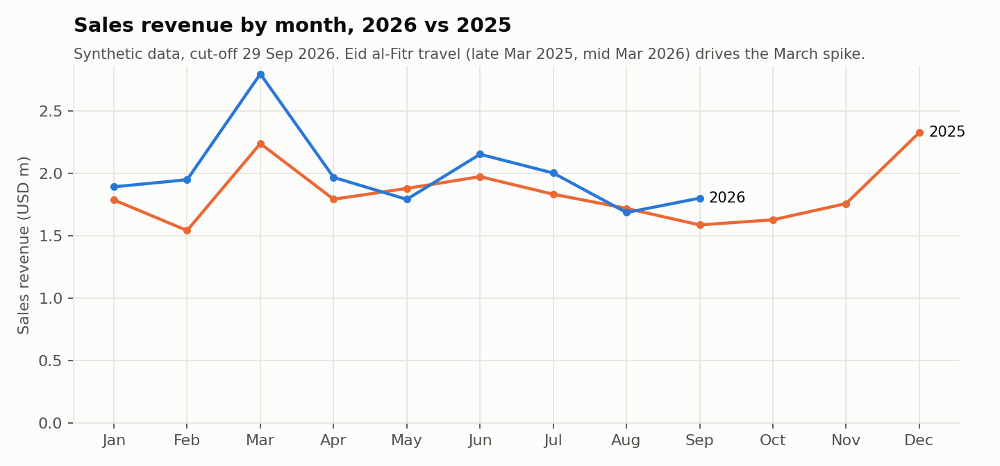
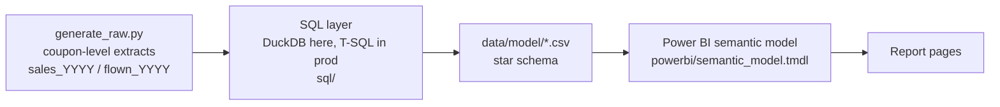
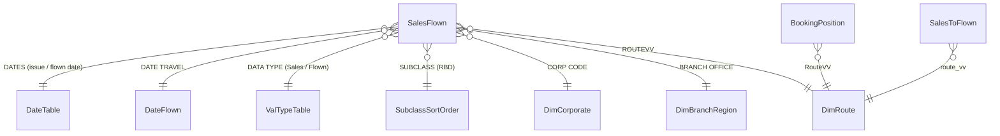
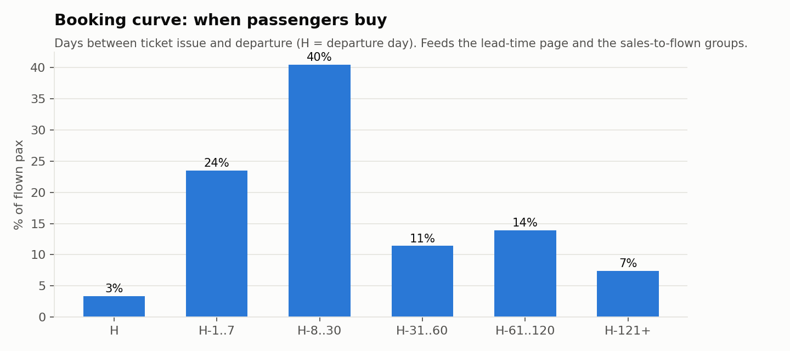
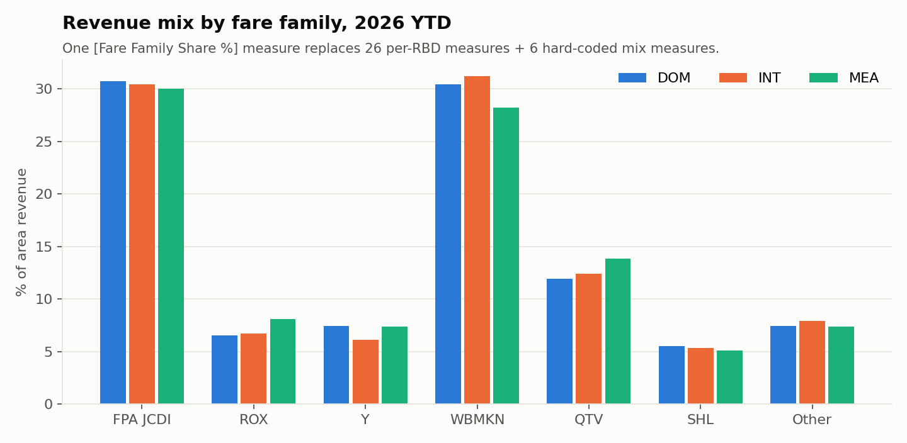
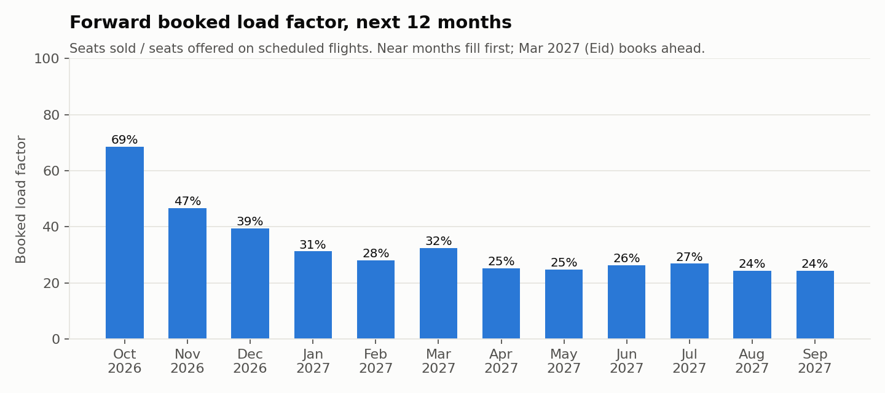

# Airline Sales & Flown Performance BI

End-to-end airline commercial analytics project: **SQL data model, Power BI semantic model (82 DAX measures), and a reproducible synthetic dataset**.

It is a public rebuild of a sales performance dashboard I built and maintain as a Data Analyst in airline Sales & Distribution. The model design, business rules, and DAX patterns are the same. **All data is synthetic**, generated from scratch: the carrier ("XA / Archipelago Air"), agents, corporates, fares, and volumes are fictional. Only public IATA airport codes are real.



## Business questions it answers

| Page | Question | Key measures |
|---|---|---|
| Daily performance | How are sales and flown revenue tracking vs last year, up to yesterday? | `Revenue TY`, `Revenue LY`, `Revenue YoY %`, `Avg Fare TY` |
| MTD / YTD | Where do we stand month to date and year to date, like for like? | `Revenue MTD`, `Revenue MTD LY`, `Revenue Selected Period` (MTD/YTD switch) |
| Period vs period | How does any date range compare with any other (e.g. Eid 2026 vs Eid 2025)? | `Revenue P1`, `Revenue P2`, `Revenue P2 vs P1 %` |
| Channel & corporate | Which channels, agents, and corporate accounts drive revenue? | `Corporate Share %`, `Domestic %`, `International %` |
| Fare mix (RBD) | Are we selling the right booking classes? | `Fare Family Share %`, `FPA JCDI %`, `QTV %` |
| Route pull-out | When routes are discontinued, how much revenue is recaptured on the remaining network? | `Revenue PO P1/P2`, `Pull Out Revenue Recaptured %` |
| Booking curve | How far ahead do passengers buy? | `% of Total Pax (Lead Time)`, `Avg Lead Time (days)` |
| Forward BLF | How full are future flights? | `BLF %`, `Seats Unsold` |
| Group desk | How is the group booking pipeline converting? | `Group Pax Confirmed`, `Group Cancel Rate %` |

Headline from the synthetic data (cut-off 29 Sep 2026): **sales revenue YTD +10.7% YoY, pax +7.5%**. Four routes pulled out in April 2026 lost USD 0.33m of Apr-Sep flown revenue while the active network grew USD 0.85m.

## Architecture



The production pipeline runs the T-SQL in `sql/tsql/` on SQL Server and Power BI imports the result. Here the same logic runs on DuckDB so anyone can reproduce it on a laptop.

## Data model



Disconnected tables: `PeriodSelector` (MTD/YTD switch), `Calendar_Slicer1/2` and `Calendar_Slicer_PO1/PO2` (two independent date ranges per comparison page), `_Measures` (measure home), `GroupBooking` (group desk sheet).

### Design decisions

- **One fact table for Sales and Flown.** Sales (by date of issue) and Flown (by date of travel) are unioned into one grain with a `DATA TYPE` column. Every measure works for both, the user flips with one slicer. No duplicated measure sets.
- **Union first, join and aggregate once.** The source query unions four yearly extracts of raw rows, then joins lookups and groups a single time. The lookup that needed `DISTINCT` is computed once in a CTE.
- **Data cut-off baked into every TY/LY measure.** `_MaxDateInData` caps this year at the last loaded day and last year at the same day minus 12 months, so a half-finished month is never compared with a full one.
- **Airline sales week.** Week 1 is the days before the first Monday of the year, then Monday-based weeks. Computed in SQL independent of server `DATEFIRST`.
- **Two date tables.** `DateTable` (issue / flown date) and `DateFlown` (travel date on sales tickets) so "what we sold" and "when they fly" can be read side by side.
- **Route dimension instead of a hard-coded list.** The route status (Active / Pull Out) was an 80-value grouping inside the fact table; it now lives in `DimRoute`, which also replaces a many-to-many fact-to-BLF relationship with a clean star.

See [docs/refactor_notes.md](docs/refactor_notes.md) for the before/after of each DAX change.

## DAX highlights

```dax
Revenue LY =
VAR CutoffDateLY = EDATE ( [_MaxDateInData], -12 )
RETURN
    CALCULATE (
        [Revenue],
        SAMEPERIODLASTYEAR ( DateTable[Date] ),
        KEEPFILTERS ( DateTable[Date] <= CutoffDateLY )
    )
```

```dax
Fare Family Share % =
DIVIDE ( [Revenue TY], CALCULATE ( [Revenue TY], REMOVEFILTERS ( SubclassSortOrder ) ) )
-- replaces 26 copy-paste "RBD F", "RBD R" ... measures and 6 hard-coded mix measures
```

```dax
Revenue P1 =
CALCULATE (
    SUM ( SalesFlown[NETT USD] ),
    KEEPFILTERS ( TREATAS ( VALUES ( Calendar_Slicer1[Date] ), DateTable[Date] ) )
)
-- disconnected calendar: compare any two date ranges on one page
```

Full list with notes: [docs/measure_catalog.md](docs/measure_catalog.md). All measures as one runnable DAX query: [dax/measures.dax](dax/measures.dax).

| Booking curve | Fare family mix | Forward BLF |
|---|---|---|
|  |  |  |

## Run it

```bash
pip install -r requirements.txt
python generator/generate_raw.py      # coupon-level synthetic extracts -> data/raw (seeded, reproducible)
python generator/build_model.py       # SQL layer (DuckDB) -> data/model/*.csv
python generator/build_tmdl.py        # Power BI model script, DAX query file, measure catalog
python generator/make_previews.py     # README charts
```

Or `make all`. Options: `--asof 2026-09-29` (data cut-off), `--scale 2.5` (volume), `--seed 42`.

### Load into Power BI Desktop

1. Clone the repo to `C:\airline-sales-performance-bi` (or anywhere and change the `DataFolder` parameter).
2. Open a blank report. Turn on **Options > Preview features > TMDL view** if needed.
3. In **TMDL view**, paste the contents of `powerbi/semantic_model.tmdl` and click **Apply**.
4. **Refresh**. All tables, relationships, and 82 measures load from `data/model`.
5. Mark `DateTable` as the date table (`Date` column) and build the pages.

## Repo layout

```
generator/   generate_raw.py, build_model.py, build_tmdl.py, make_previews.py
sql/duckdb/  fact_sales_flown, sales_to_flown, booking_load_factor (runs in the pipeline)
sql/tsql/    SQL Server version of the fact query (production dialect)
powerbi/     semantic_model.tmdl (tables, M queries, relationships, measures)
dax/         measures.dax (DAX query view)
data/model/  Power BI-ready star schema (CSV)
docs/        data dictionary, measure catalog, refactor notes, images
```

## Tech

SQL Server (T-SQL), DuckDB, Python (pandas, NumPy), Power BI (DAX, Power Query M, TMDL), matplotlib.

## Data disclaimer

No real company data, names, figures, credentials, or internal system details are included. Volumes are scaled down and every entity is invented. Business rules (fare families, cut-off logic, sales vs flown definitions) are generic airline industry practice.
